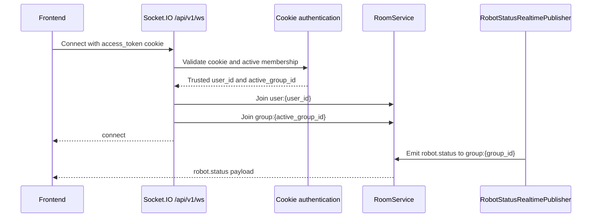

# Frontend Socket.IO Connection and Room Subscription

This guide shows how a frontend connects to Pleco's Socket.IO server, receives
group-scoped robot status, and explicitly subscribes to a map room.

## Connection Contract

| Setting | Value |
|---|---|
| Backend origin (local example) | `http://localhost:8000` |
| Socket.IO transport path | `/api/v1/ws` |
| Namespace | `/` |
| Authentication | Existing HTTP-only `access_token` cookie |
| Robot status event | `robot.status` |
| Map subscription event | `map.subscribe` |
| Map unsubscription event | `map.unsubscribe` |

Use `socket.io-client`; `/api/v1/ws` is a Socket.IO transport path and is not a
native WebSocket endpoint.

## Room Membership

The frontend never sends user or group IDs when connecting. After validating
the cookie, the backend assigns automatic rooms from the trusted credential:

| Room | How it is joined | Frontend action |
|---|---|---|
| `user:{user_id}` | Automatically during connection | None |
| `group:{active_group_id}` | Automatically during connection | Connect after login |
| `map:{map_id}` | Explicitly after authorization | Emit `map.subscribe` |

A user without an active group can connect to the user room but will not receive
group-scoped `robot.status` events. There is intentionally no `group.subscribe`
event, so a client cannot request membership in an arbitrary group.

## 1. Install the Client

```bash
npm install socket.io-client
```

Use a Socket.IO JavaScript client from the v4 release line.

## 2. Create One Shared Client

Create `src/realtime/socket.ts`:

```typescript
import { io } from "socket.io-client";

const API_URL = import.meta.env.VITE_API_URL ?? "http://localhost:8000";

export const socket = io(API_URL, {
  path: "/api/v1/ws",
  withCredentials: true,
  autoConnect: false,
});

export function connectRealtime(): void {
  if (!socket.connected) {
    socket.connect();
  }
}

export function disconnectRealtime(): void {
  socket.disconnect();
}
```

Pass only the backend origin to `io()`. Configure `/api/v1/ws` through the
`path` option instead of appending it to `API_URL`.

`withCredentials: true` allows the browser to send the HTTP-only authentication
cookie during the Socket.IO handshake. The frontend must not read the cookie or
copy it into the Socket.IO `auth` payload.

## 3. Connect After Login

Connect only after the HTTP login request has successfully established the
authentication cookie:

```typescript
import { connectRealtime, socket } from "./realtime/socket";

socket.on("connect", () => {
  console.info("Socket.IO connected", socket.id);
});

socket.on("connect_error", (error) => {
  console.error("Socket.IO connection failed", error.message);
});

connectRealtime();
```

Successful connection automatically joins the authenticated user's user room
and, when present, active-group room. Socket.IO automatically restores these
automatic rooms by running the backend connection handler after a reconnect.

Call `disconnectRealtime()` on logout. If an HTTP operation changes the active
group and rotates the authentication cookie, reconnect so the backend leaves
the old connection behind and resolves the new active group:

```typescript
socket.disconnect();
socket.connect();
```

## 4. Receive Group-Scoped Robot Status

Define the public payload:

```typescript
export interface RobotStatus {
  robot_id: string;
  ip_address: string | null;
  connection_status: "ONLINE" | "STALE" | "OFFLINE";
  operational_status: "IDLE" | "EXECUTING" | "CHARGING";
  last_seen_at: string;
}
```

Register a listener for `robot.status`:

```typescript
import type { RobotStatus } from "./types";
import { socket } from "./socket";

function handleRobotStatus(status: RobotStatus): void {
  console.info("Robot status updated", status);
  // Update React Query, Redux, Zustand, or local state here.
}

socket.on("robot.status", handleRobotStatus);

// Remove this listener when its owner is disposed.
socket.off("robot.status", handleRobotStatus);
```

No additional room event is needed. The backend publishes status using the
persisted robot's group:

```text
persisted bot.group_id
  -> group:{group_id}
  -> robot.status
  -> authenticated sockets in that group
```

The update is transient. After reconnecting, use the normal HTTP API to refresh
the current robot state rather than expecting missed Socket.IO events to replay.

## 5. Subscribe to a Map Room

Map rooms are dynamic and require an explicit request. The payload must contain
only a camel-case `mapId` with a valid UUID:

```typescript
type RoomAcknowledgement =
  | { success: true }
  | {
      success: false;
      error:
        | "AUTHENTICATION_REQUIRED"
        | "INVALID_PAYLOAD"
        | "GROUP_REQUIRED"
        | "MAP_NOT_FOUND"
        | "MAP_ACCESS_DENIED"
        | "ROOM_OPERATION_FAILED"
        | "INTERNAL_ERROR";
    };

export function subscribeToMap(
  mapId: string,
): Promise<RoomAcknowledgement> {
  return new Promise((resolve, reject) => {
    socket.timeout(5_000).emit(
      "map.subscribe",
      { mapId },
      (timeoutError: Error | null, acknowledgement?: RoomAcknowledgement) => {
        if (timeoutError) {
          reject(new Error("Map subscription timed out"));
          return;
        }

        if (!acknowledgement) {
          reject(new Error("Map subscription returned no acknowledgement"));
          return;
        }

        resolve(acknowledgement);
      },
    );
  });
}
```

Call it when the map view mounts or after the selected map changes:

```typescript
const acknowledgement = await subscribeToMap(mapId);

if (!acknowledgement.success) {
  console.error("Map subscription rejected", acknowledgement.error);
}
```

Dynamic map membership is lost when the socket disconnects. Subscribe again in
the Socket.IO `connect` handler so the map room is restored after reconnection:

```typescript
function subscribeCurrentMap(): void {
  void subscribeToMap(mapId);
}

socket.on("connect", subscribeCurrentMap);

// During cleanup:
socket.off("connect", subscribeCurrentMap);
```

## 6. Leave a Map Room

When the map view unmounts, emit `map.unsubscribe` with the same payload:

```typescript
socket.emit(
  "map.unsubscribe",
  { mapId },
  (acknowledgement: RoomAcknowledgement) => {
    if (!acknowledgement.success) {
      console.error("Map unsubscription failed", acknowledgement.error);
    }
  },
);
```

Leaving a map room does not remove the socket from its automatic user or group
rooms. Do not disconnect the shared socket merely because one page unmounts.

## React Integration Example

```tsx
import { useEffect } from "react";

import { connectRealtime, socket } from "./realtime/socket";
import type { RobotStatus } from "./realtime/types";

export function RobotStatusListener(): null {
  useEffect(() => {
    const handleRobotStatus = (status: RobotStatus) => {
      console.info("Robot status updated", status);
    };

    socket.on("robot.status", handleRobotStatus);
    connectRealtime();

    return () => {
      socket.off("robot.status", handleRobotStatus);
    };
  }, []);

  return null;
}
```

Mount one listener near the application root. Feature components should attach
and remove their own event listeners without creating additional socket clients.

## Connection Flow



## Troubleshooting

### Connection is rejected

- Confirm login completed before calling `socket.connect()`.
- Confirm the login and Socket.IO requests both include credentials.
- Confirm the frontend origin is present in the backend CORS allowlist.
- Confirm the access token is current and has not been revoked.
- Confirm an active-group claim still represents a valid membership.

### Connected but robot status is not received

- Confirm the authenticated user has the expected active group.
- Confirm the robot belongs to that same persisted group.
- Confirm the listener uses exactly `robot.status`.
- Remember that events are emitted only for meaningful status changes.
- Reconnect after changing the active group.

### Native WebSocket connection fails

Do not use:

```typescript
new WebSocket("ws://localhost:8000/api/v1/ws");
```

The endpoint speaks the Socket.IO/Engine.IO protocol and requires
`socket.io-client`.

## Deployment Note

The current Socket.IO server and room registry are process-local. A deployment
with multiple backend workers requires a distributed Socket.IO manager before
room events can reliably reach clients connected to different workers.

